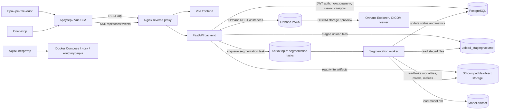
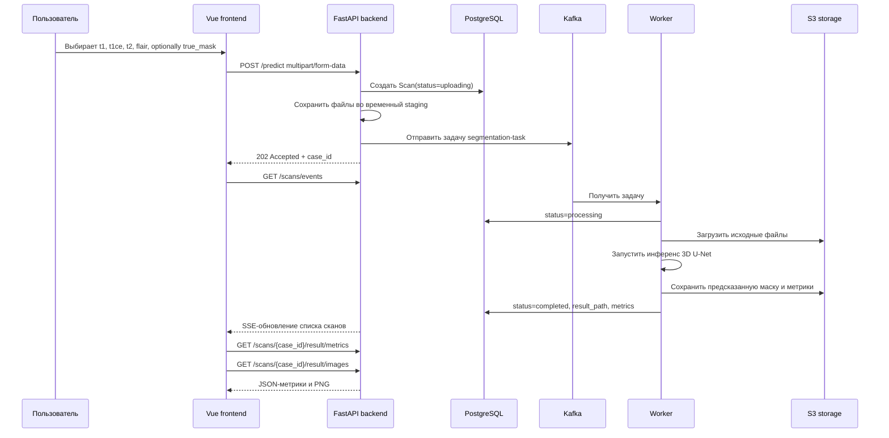
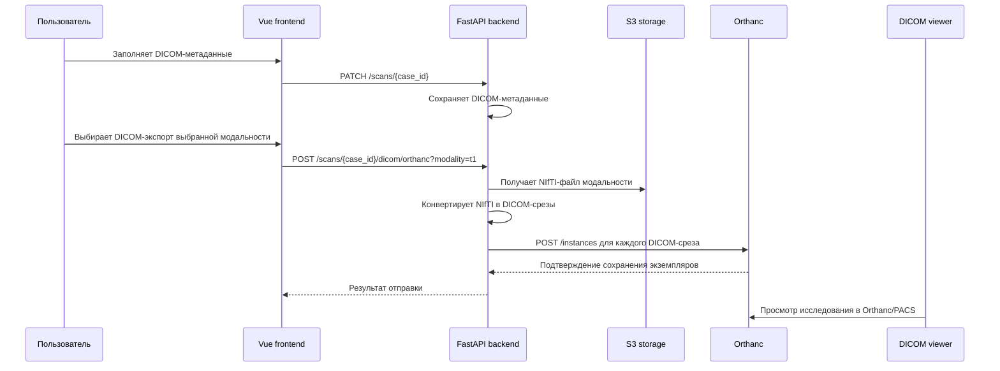

# 2.2 — Архитектурная модель учебного ИИ-сервиса

## 1. Назначение документа

Документ описывает архитектурную модель учебного ИИ-сервиса сегментации глиомы, состав компонентов, потоки данных, интерфейсы и эксплуатационные сценарии. Документ подготовлен как результат практической работы 2.2 и опирается на требования из `docs/2.1_requirements.md`.

## 2. Контекст системы

Сервис предназначен для загрузки МРТ-исследований в формате NIfTI, запуска модели сегментации опухоли головного мозга, хранения результатов и просмотра предсказанных масок в веб-интерфейсе. Дополнительно сервис поддерживает учебную интеграцию с DICOM-контуром через экспорт DICOM-срезов и отправку их в Orthanc.

Внешние участники и системы:

- врач-рентгенолог;
- оператор;
- администратор;
- браузер пользователя;
- Orthanc как учебный PACS-архив;
- S3-совместимое объектное хранилище;
- PostgreSQL;
- Kafka.

## 3. Архитектурная схема



## 4. Основные компоненты

| Компонент | Назначение | Технологии |
| --- | --- | --- |
| Frontend | Пользовательский интерфейс для загрузки исследований, просмотра статусов, метрик, PNG и DICOM-экспорта | Vue 3, Vite, PrimeVue, Axios |
| Nginx | Единая точка входа, проксирование frontend и backend | Nginx |
| Backend API | Авторизация, REST API, SSE, управление сканами, постановка задач, визуализация результатов, DICOM-экспорт | FastAPI, SQLAlchemy, PyTorch-related utilities, pydicom, httpx |
| Segmentation worker | Асинхронная обработка задач, запуск модели, сохранение маски и метрик | Python, PyTorch, nibabel, Kafka consumer |
| Kafka | Очередь задач сегментации | Kafka / aiokafka |
| PostgreSQL | Хранение пользователей, сканов, статусов, DICOM-метаданных, ссылок на артефакты | PostgreSQL |
| S3-compatible storage | Хранение NIfTI-файлов, предсказанных масок, PNG и метрик | S3 API |
| Orthanc | Учебный DICOM/PACS-контур для приёма DICOM-экспорта | Orthanc REST, DICOM |
| Model artifact | Файл обученной модели сегментации | `model.pth` |

## 5. Поток обработки NIfTI-исследования



## 6. Поток DICOM-экспорта в Orthanc



## 7. Таблица интерфейсов

| Интерфейс | Участники | Протокол / технология | Формат данных | Назначение | Примеры операций |
| --- | --- | --- | --- | --- | --- |
| REST API | Frontend → Backend | HTTP/HTTPS REST | JSON, multipart/form-data, PNG, ZIP | Основной интерфейс приложения | `POST /predict`, `GET /scans`, `GET /scans/{case_id}`, `GET /scans/{case_id}/result/metrics` |
| SSE | Frontend ← Backend | Server-Sent Events over HTTP | `text/event-stream`, JSON-события | Обновление статусов обработки без перезагрузки страницы | `GET /scans/events` |
| Kafka | Backend → Worker | Kafka topic | JSON-сообщение задачи | Асинхронная постановка задач сегментации | topic `segmentation-tasks` |
| PostgreSQL | Backend / Worker → DB | PostgreSQL wire protocol | Таблицы users, scans, metadata | Хранение пользователей, статусов, метаданных и ссылок на артефакты | INSERT/UPDATE scan, SELECT scans |
| S3 | Backend / Worker → Object Storage | S3 API | NIfTI, JSON, CSV, PNG | Хранение крупных файлов и результатов | upload modalities, download result mask |
| Orthanc REST | Backend → Orthanc | HTTP REST | DICOM instances | Передача DICOM-срезов в учебный PACS | `POST /instances` |
| DICOM | Orthanc ↔ Viewer / PACS | DICOM / DICOMweb / DIMSE в расширенном сценарии | DICOM-файлы и метаданные | Хранение и просмотр медицинских изображений | Store, Query/Retrieve, web-view |
| File import/export | Пользователь ↔ Frontend / Backend | Browser download/upload | `.nii`, `.nii.gz`, `.zip`, `.png`, `.json`, `.csv` | Загрузка исходных данных и выгрузка результатов | upload NIfTI, download DICOM ZIP, export metrics |

## 8. REST endpoints учебного MVP

| Метод | Endpoint | Назначение | Авторизация |
| --- | --- | --- | --- |
| `POST` | `/auth/register` | Регистрация пользователя | Нет |
| `POST` | `/auth/login` | Получение JWT | Нет |
| `GET` | `/auth/me` | Получение текущего пользователя | Да |
| `POST` | `/predict` | Загрузка NIfTI-комплекта и постановка задачи | Да |
| `GET` | `/scans` | Список сканов текущего пользователя | Да |
| `GET` | `/scans/{case_id}` | Карточка скана и DICOM-метаданные | Да |
| `GET` | `/scans/events` | SSE-поток обновлений | Да |
| `GET` | `/scans/{case_id}/result/metrics` | Метрики сегментации | Да |
| `GET` | `/scans/{case_id}/result/images` | PNG-срез маски или overlay | Да |
| `GET` | `/scans/{case_id}/dicom` | Скачать DICOM ZIP | Да |
| `POST` | `/scans/{case_id}/dicom/orthanc` | Отправить DICOM-срезы в Orthanc | Да |
| `PATCH` | `/scans/{case_id}` | Обновить имя скана или DICOM-метаданные | Да |
| `DELETE` | `/scans/{case_id}` | Удалить скан | Да |

## 9. Событийная модель Kafka

Топик: `segmentation-tasks`.

Пример сообщения:

```json
{
  "case_id": "uuid-or-internal-id",
  "user_id": 1,
  "staging_paths": {
    "t1": "/upload-staging/case/t1.nii.gz",
    "t1ce": "/upload-staging/case/t1ce.nii.gz",
    "t2": "/upload-staging/case/t2.nii.gz",
    "flair": "/upload-staging/case/flair.nii.gz",
    "true_mask": "/upload-staging/case/seg.nii.gz"
  },
  "created_at": "2026-05-31T00:00:00Z"
}
```

Требования:

- сообщение должно содержать идентификатор исследования;
- worker должен быть идемпотентен на уровне повторной обработки одного `case_id`;
- при ошибке обработки worker должен записывать статус `failed` и текст технической ошибки;
- повторная обработка может быть реализована отдельным endpoint или повторной постановкой задачи администратором.

## 10. Модель данных PostgreSQL

Минимальные сущности:

| Сущность | Поля | Назначение |
| --- | --- | --- |
| User | `id`, `username`, `password_hash`, `created_at` | Учётные записи пользователей |
| Scan | `id`, `user_id`, `name`, `status`, `created_at`, `updated_at`, `result_path`, `metrics`, `error_message` | Исследования и результаты обработки |
| DicomMetadata | `scan_id`, `patient_id`, `patient_name`, `study_uid`, `series_uid`, `study_description`, `series_description` | Метаданные для DICOM-экспорта |

Статусы обработки:

```text
uploading -> queued -> processing -> completed
                         └---------> failed
```

## 11. Хранилище S3

Рекомендуемая структура ключей:

```text
scans/{user_id}/{case_id}/input/t1.nii.gz
scans/{user_id}/{case_id}/input/t1ce.nii.gz
scans/{user_id}/{case_id}/input/t2.nii.gz
scans/{user_id}/{case_id}/input/flair.nii.gz
scans/{user_id}/{case_id}/input/true_mask.nii.gz
scans/{user_id}/{case_id}/result/pred_mask.nii.gz
scans/{user_id}/{case_id}/result/metrics.json
scans/{user_id}/{case_id}/result/metrics.csv
scans/{user_id}/{case_id}/result/png/{slice_idx}.png
```

Требования:

- большие медицинские файлы не должны храниться в PostgreSQL;
- PostgreSQL хранит только метаданные и ссылки на объекты;
- удаление скана должно удалять связанные объекты или помечать их для последующей очистки.

## 12. Безопасность

| Область | Требование |
| --- | --- |
| Аутентификация | JWT-токен для защищённых endpoints |
| Авторизация | Пользователь имеет доступ только к своим сканам |
| Пароли | Хранение только хеша пароля |
| Сетевой доступ | В production backend и Orthanc не должны быть открыты без reverse proxy и авторизации |
| Переменные окружения | Секреты JWT, S3 и Orthanc задаются через `.env` или secret-хранилище |
| DICOM-данные | В учебном стенде рекомендуется использовать деидентифицированные данные |
| Логи | Логи не должны содержать чувствительные персональные данные |

## 13. Журналирование и трассировка

Минимальные события для логирования:

- регистрация и вход пользователя без записи пароля;
- загрузка исследования;
- создание `case_id`;
- постановка задачи в Kafka;
- получение задачи worker-ом;
- начало инференса;
- завершение инференса;
- сохранение маски и метрик;
- ошибка обработки;
- DICOM-экспорт;
- отправка в Orthanc;
- удаление исследования.

Рекомендуемые поля логов:

```text
timestamp, level, service, case_id, user_id, event, duration_ms, error
```

## 14. Отказоустойчивость

| Сбой | Поведение системы | Восстановление |
| --- | --- | --- |
| Worker недоступен | Задачи остаются в Kafka | Перезапуск worker, повторное чтение задач |
| Backend недоступен | Пользовательский интерфейс не может выполнять операции | Перезапуск backend |
| PostgreSQL недоступен | Невозможно авторизоваться и обновлять статусы | Проверить БД, восстановить контейнер |
| S3 недоступен | Невозможно сохранить или получить файлы | Повторить обработку после восстановления S3 |
| Kafka недоступна | Невозможно поставить новые задачи | Перезапустить Kafka и backend producer |
| Orthanc недоступен | DICOM-экспорт в PACS недоступен | Результаты остаются в сервисе, экспорт можно повторить позже |
| Ошибка инференса | Статус исследования `failed` | Исправить входные данные или модель, выполнить повторную обработку |

## 15. Масштабирование

Возможные направления масштабирования:

- увеличить число worker-контейнеров для параллельной обработки задач;
- вынести PostgreSQL и S3 в управляемые сервисы;
- использовать отдельный GPU-сервер для worker;
- добавить отдельный сервис препроцессинга DICOM → NIfTI;
- добавить отдельный сервис генерации DICOM SEG / secondary capture;
- добавить централизованный сбор логов и метрик.

Ограничение: при масштабировании worker-ов необходимо следить, чтобы одна и та же задача не обрабатывалась конкурентно несколькими worker-ами без идемпотентной логики.

## 16. Эксплуатационные сценарии

### 16.1. Основной сценарий

1. Пользователь загружает NIfTI-комплект.
2. Backend создаёт скан и ставит задачу в Kafka.
3. Worker выполняет сегментацию.
4. Результаты сохраняются в S3 и PostgreSQL.
5. Пользователь получает обновление через SSE.
6. Пользователь просматривает метрики и PNG.

### 16.2. Сценарий DICOM-экспорта

1. Пользователь открывает карточку скана.
2. Пользователь заполняет DICOM-метаданные.
3. Пользователь выбирает модальность.
4. Backend конвертирует NIfTI в DICOM-срезы.
5. Пользователь скачивает ZIP или отправляет срезы в Orthanc.
6. Orthanc принимает DICOM-экземпляры.
7. Исследование доступно для просмотра в Orthanc Explorer или подключённом просмотрщике.

### 16.3. Сценарий ошибки

1. Пользователь загружает неполный или некорректный комплект.
2. Backend или worker фиксирует ошибку.
3. Статус исследования становится `failed`.
4. Пользователь видит, что обработка не завершилась.
5. Оператор повторяет загрузку с корректными файлами.

## 17. Границы текущего MVP

В текущем учебном MVP реализуется связка:

```text
NIfTI upload -> REST backend -> Kafka -> worker -> model inference -> S3/PostgreSQL -> PNG/metrics -> DICOM export -> Orthanc
```

Полный промышленный контур РИС/PACS может включать дополнительные функции, которые выходят за рамки MVP:

- DICOM C-STORE SCP/SCU;
- DICOMweb STOW-RS/QIDO-RS/WADO-RS;
- автоматический DICOM router;
- DICOM SEG для масок сегментации;
- HL7/FHIR-интеграция с РИС/МИС;
- аудит действий пользователей по требованиям медицинской организации;
- управление версиями модели в MLOps-контуре.

## 18. Связанные документы

- `docs/2.1_requirements.md` — требования к учебному ИИ-сервису.
- `docs/model_passport.md` — паспорт модели сегментации.
- `README.md` — инструкция по запуску и описание реализации.
